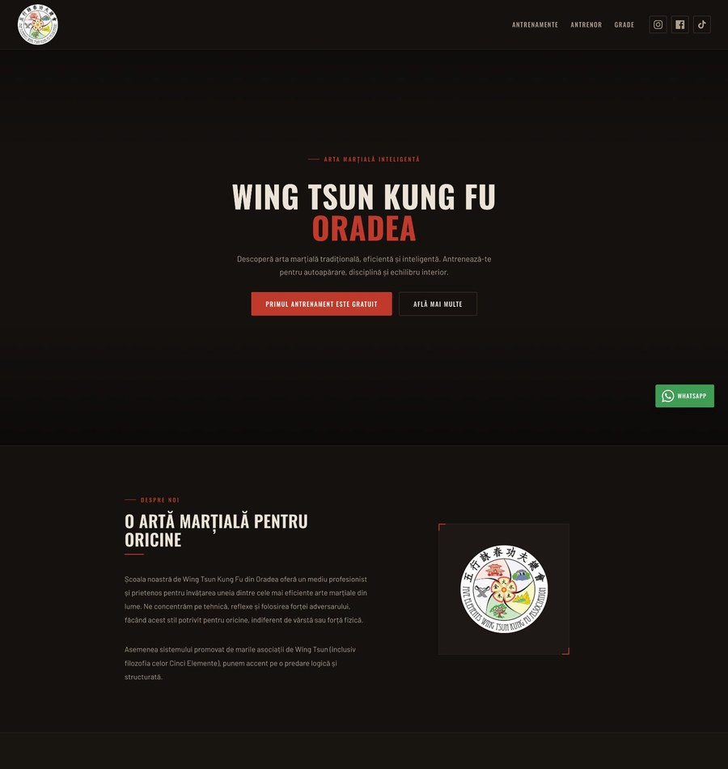
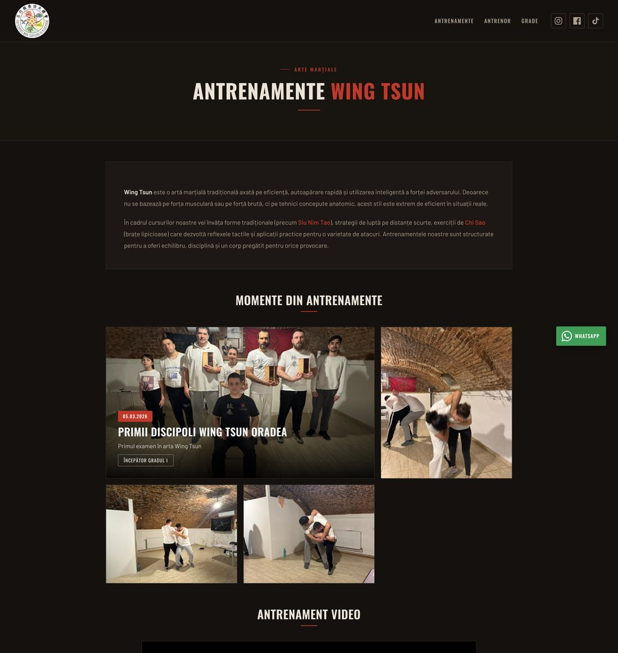
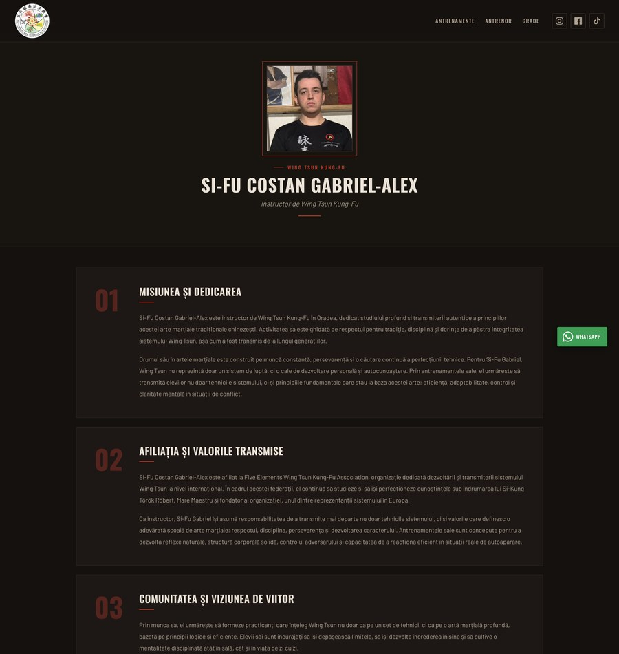
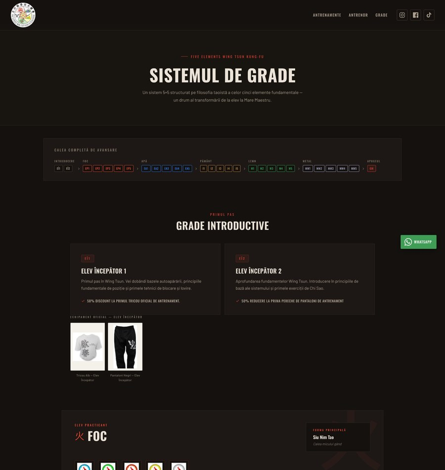

<div align="center">


# Wing Tsun Kung Fu Oradea

Landing site for the **Wing Tsun Kung Fu school in Oradea, Romania** — training schedule,
grading system, instructor profile, and direct sign-ups via WhatsApp.

[](https://wingtsun.netlify.app/)
[](https://angular.io/)
[](https://www.netlify.com/)

**[wingtsun.netlify.app](https://wingtsun.netlify.app/)**

</div>

---

## Preview

| Home | Training |
|------|----------|
| [](src/assets/github/home_full.jpg) | [](src/assets/github/antrenamente_full.jpg) |

| Instructor | Grading System |
|------------|----------------|
| [](src/assets/github/antrenor_full.jpg) | [](src/assets/github/grade_full.jpg) |

> Click any image for the full-size version.

---

## Features

- **Home page** with hero, "About" section, training schedule, pricing, events, testimonials, FAQ, and contact.
- **Contact form** that sends the message straight to **WhatsApp**.
- **Grading system** — a 5x5 structure based on the philosophy of the five elements, with forms, gear, and promotion requirements.
- **Instructor page** with a photo gallery (lightbox) and video material.
- **Training gallery** with lightbox and image-to-image navigation.
- **Responsive design**, dark "dojo" theme, and a floating WhatsApp button.
- **Custom 404** page.

---

## Pages and routes

| Route | Page |
|-------|------|
| `/` | Home |
| `/despre` | Wing Tsun training |
| `/antrenor` | Instructor profile (Si-Fu) |
| `/grade` | Grading system |
| `/program`, `/contact` | Redirect to `/` (anchors on the home page) |
| `*` | 404 page |

---

## Tech stack

- [Angular](https://angular.io/) **16** (TypeScript)
- Routing with `@angular/router` (`scrollPositionRestoration` + `anchorScrolling`)
- [AOS](https://michalsnik.github.io/aos/) for scroll animations
- Custom CSS with a variable-based design system (centralized theme, no UI framework)
- Fonts: **Oswald** + **Barlow** (Google Fonts)
- Deployed on [Netlify](https://www.netlify.com/)

---

## Project structure

```
src/
├── app/
│   ├── home/        # Home page
│   ├── workout/     # Training + gallery
│   ├── trainer/     # Instructor page
│   ├── grades/      # Grading system
│   ├── navbar/      # Navigation bar
│   ├── footer/      # Footer
│   └── not-found/   # 404 page
├── assets/          # Images, logos, video, README screenshots
├── styles.css       # Global theme (CSS variables)
└── index.html
```

---

